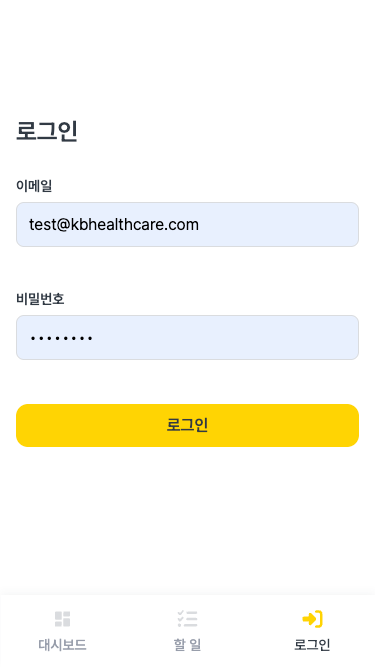
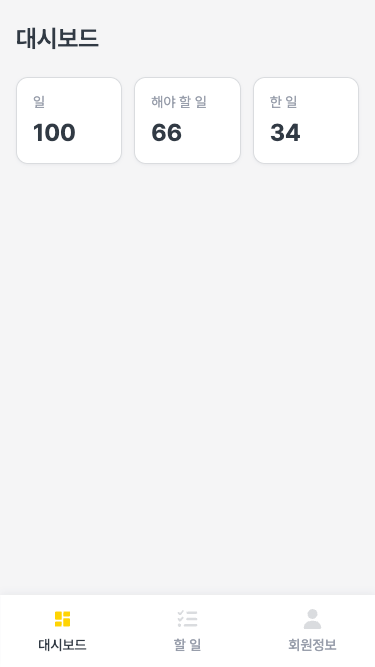
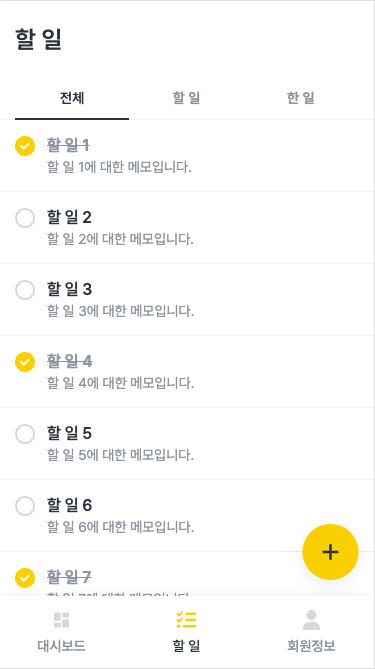
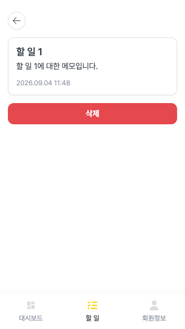

# KB헬스케어 프론트엔드 과제

## 화면

|                         로그인                         |                         대시보드                         |                     할 일 목록                      |
| :----------------------------------------------------: | :------------------------------------------------------: | :-------------------------------------------------: |
|  |  |  |

|                         할 일 상세                         |                        회원정보                        |                          비로그인상태                          |
| :--------------------------------------------------------: | :----------------------------------------------------: | :------------------------------------------------------------: |
|  |  |  |

<br/><br/>

## 실행 방법

```bash
npm install
npm run dev
```

| 명령                         | 설명                                    |
| :--------------------------- | :-------------------------------------- |
| `npm run dev`                | 개발 서버 실행 (mock API)               |
| `npm run build`              | 프로덕션 빌드 (`tsc -b` + `vite build`) |
| `npm run preview`            | 빌드 결과 미리보기                      |
| `npm run test`               | vitest 유닛/컴포넌트 테스트             |
| `npm run typecheck`          | 타입 체크                               |
| `npm run lint`               | ESLint                                  |
| `npm run format`             | Prettier                                |
| `npm run generate:api-types` | `docs/openapi.yaml`에서 TS 타입 재생성  |

<br/>

**계정**: `test@kbhealthcare.com` / `test1234`
<br/><br/>

### 환경변수

```bash
VITE_USE_MOCK=true # MSW 사용 여부
VITE_API_BASE_URL=https://실제-API-주소
```

<br/><br/>

## 폴더 구조

```
src/
├── api/
├── app/         # 라우트 정의(App.tsx)
├── components/  # 페이지 간 공유 컴포넌트
├── context/     # AuthContext — accessToken 상태와 로그인/로그아웃
├── hooks/       # 페이지별 react-query 훅
├── lib/         # 순수 유틸 함수
├── mocks/       # MSW 핸들러와 mock 데이터
├── pages/       # 라우트에 대응하는 화면
|                  Next.js처럼 URL 경로 = 폴더 구조, 각 폴더의 진입점은 page.tsx
├── styles/      # 디자인 토큰
└── types/       # openapi-typescript로 생성된 타입
```

<br/><br/>

## 기술 스택

| 선택                     | 이유                                                                                    |
| :----------------------- | :-------------------------------------------------------------------------------------- |
| react-router             | 인증 가드(`RequireAuth`)와 `state`를 이용한 로그인 후 경로 복귀 구현에 적합             |
| @tanstack/react-query    | 로딩/에러/캐시 상태 관리, 할 일 목록의 무한 스크롤(`useInfiniteQuery`)                  |
| @tanstack/react-virtual  | 항목 수가 늘어나도 DOM에는 화면에 보이는 행만 유지                                      |
| react-hook-form + zod    | 스키마 기반 검증과 제출 버튼 활성화 조건을 선언적으로 처리                              |
| openapi-typescript       | `docs/openapi.yaml`을 타입의 단일 소스로 사용, 스펙 변경 시 타입도 함께 갱신            |
| msw                      | 네트워크 레벨 모킹이라 실 API 전환 시 호출부 코드 변경 없이 `VITE_USE_MOCK`만 바꾸면 됨 |
| CSS Modules + CSS 변수   | "색상은 CSS 변수 등 일관된 토큰으로 관리" 요구사항과 직접 대응                          |
| react-icons              | 기능별로 구분되는 아이콘                                                                |
| vitest + Testing Library | Vite 프로젝트와 설정 공유, jsdom 환경에서 컴포넌트 테스트                               |

<br/><br/>

## 요구사항/API 변경

요구사항·API 계약과 다르게 해석했거나, API 계약을 수정한 사항입니다.

### 할 일 목록: 카드 -> 전체 너비 리스트

requirement.md는 카드 목록으로 표시하라고 되어 있지만, <br/>
모바일 화면에서 체크박스와 본문(제목/메모)이 가로로 나란히 배치되도록 가로 너비를 최대한 확보하기 위해<br/>
카드로 묶지 않고 전체 너비 리스트로 구현했습니다.

<br/>

### endpoint 추가

할 일 추가/완료 토글/로그아웃 기능을 위해 스펙에 없는 endpoint를 mock 서버에만 추가했습니다.

| Endpoint              | 용도                                |
| :-------------------- | :---------------------------------- |
| `POST /api/task`      | 할 일 추가                          |
| `PATCH /api/task/:id` | 완료 상태 토글                      |
| `POST /api/sign-out`  | 로그아웃 (refreshToken 쿠키 무효화) |

<br/>

### 인증 가드

비로그인 상태로 보호된 라우트에 접근하면 "로그인 후 이용하실 수 있습니다."라는 안내 문구와 로그인 버튼을 보여줍니다. <br/>
로그인 성공 시 원래 경로로 돌아가는 동작(`react-router`의 `state.from`)은 동일하게 유지하였습니다.

<br/>

### 추가 UX 개선

요구사항에는 없지만 사용성을 위해 자체적으로 추가했습니다.

- 할 일 추가/삭제 시 결과를 토스트로 안내
- 새로 추가한 항목은 목록에서 3초간 하이라이트

<br/><br/>

## 검증 방법

- 자동 검사: `npm run typecheck`, `npm run lint`, `npm run test`, `npm run build`
- 사용자 시나리오
  - 로그인 성공/실패 시 에러 모달 표시
  - 새로고침 후 세션 유지
  - 로그아웃 후 재로그인되지 않음
  - 비로그인 상태로 보호된 라우트 접근 → 로그인 → 원래 경로 복귀
  - 할 일 목록 필터·무한 스크롤·추가·완료 토글
  - 할 일 상세 삭제(ID 확인 입력 포함) 및 404 빈 상태

<br/><br/>

## 알려진 한계

- 할 일 추가·완료 토글·로그아웃은 `openapi.yaml`에 없는 endpoint로, mock 서버에만 구현되어 있어 실제 API에는 대응 endpoint가 없습니다.
- mock 데이터는 메모리에만 저장되어, 새로고침하면 시드 데이터로 초기화됩니다. 추가·삭제·완료 토글한 내용은 새로고침 전까지만 유지됩니다.
- 데스크톱 등 넓은 화면에 대한 반응형 대응 없이, 모바일 화면 기준으로만 UI를 구현했습니다.

<br/><br/>
